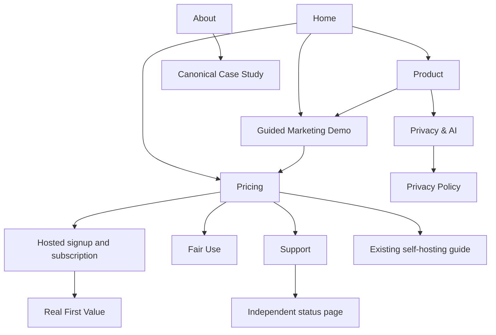

# Marketing site and demo experience

Decision artifact for [Define the complete marketing-site and demo
experience](https://github.com/nick-neely/tendnote/issues/572).

The owner agreed to the page inventory, guided fictional demo, demo-first
homepage, navigation, pricing disclosures, self-hosting alternative, and
separate marketing and product origins. This is a planning specification,
not a shipped site or approved final marketing copy.

## Audience and promise

Address the Launch Customer: an individual buying for themselves who wants
to keep what people tell them and reach out at the right time. Introduce
Tendnote as a Personal OS that starts with the people in their life. Show
the relationship loop before the supporting capabilities.

General Actions, Routines, Assets, and Household are included capabilities,
not separate launch audiences. Household is not a promised first-value
outcome. No new domains, integrations, or Eve tools are implied.

## Site addresses

The main domain serves marketing. The product lives on an `app` subdomain,
keeping its existing route paths, including `/` as admitted Home. Sign in
and Subscribe cross to the app origin; marketing links use the main origin.
This chooses the public address arrangement, not a second authentication
system or a particular deployment topology.

Implementation must audit existing links, authentication and provider callback
URLs, invitations, and origin-bound browser behavior before cutover. Existing
product links need explicit compatibility handling; do not redirect all old
paths indiscriminately or assume cookies transfer to the new origin. Detailed
cutover mechanics belong to the launch migration plan.

## Page inventory and links

Paths below are relative to the public marketing origin. Every page has an
inbound navigation or contextual link; all are directly reachable without
an account. Region restrictions apply to hosted admission, not marketing.

| Page | Path | Audience and purpose | Claim or required content | Primary next step |
| --- | --- | --- | --- | --- |
| Home | `/` | New visitor deciding whether Tendnote is relevant | Personal OS starting with relationship memory and follow-up; show the loop concretely | Explore the demo; View pricing secondary |
| Product | `/product` | Visitor evaluating the everyday job | Capture, confirm a Memory, schedule a Follow-Up, see where it resurfaces, ask Eve for grounded recall; supporting capabilities below | Explore the demo |
| Demo | `/demo` | Visitor wanting a concrete preview | Explicitly fictional, scripted relationship story, not a real AI session | View pricing |
| Pricing | `/pricing` | Prospective individual subscriber | Measured price and billing interval, one account per subscription, capabilities, limits, eligibility, support, cancellation and guarantee | Subscribe |
| About | `/about` | Visitor evaluating the operator | Author-operated service; identify the author and Neely Solutions LLC; explain the product motivation honestly | Explore the demo |
| Privacy & AI | `/privacy-and-ai` | Visitor assessing the handling of relationship information | Plain-language data flow, sharing boundaries, AI processing, operator access, export and deletion; link policy and sub-processor information | Read Privacy Policy |
| Support | `/support` | Prospect or customer needing help | One support address; hosted response commitment; billing, refund, export, deletion and privacy request directions; distinguish community self-hosting support | Contact support |
| Fair Use | `/fair-use` | Prospect or customer evaluating limits | Measured soft budget and hard ceiling in understandable usage units; function-specific normal/reduced/paused behavior and recovery conditions | View pricing |
| Terms | `/terms` | Prospective or existing customer | Counsel-reviewed contracting and service terms, consistent with the hosted obligations decision | View pricing or return to the originating flow |
| Privacy Policy | `/privacy` | Customer or other data subject | Counsel-reviewed formal policy, retention table, sub-processors and request channel | Contact support |

The support and legal pages remain useful without admission, including after
cancellation or suspension. The unavailable-region explanation belongs to the
hosted admission flow and links back to marketing and the self-hosting guide.

```text
Marketing Home (/)
├── Product (/product)
├── Demo (/demo)
├── Pricing (/pricing)
├── About (/about)
├── Privacy & AI (/privacy-and-ai)
├── Support (/support)
├── Fair Use (/fair-use)
├── Terms (/terms)
└── Privacy Policy (/privacy)
```

## Navigation and visitor journey

Header, in order: Product, Demo, Pricing, Privacy & AI, then Sign in.
The logo links Home. The homepage primary CTA is **Explore the demo**;
**View pricing** is secondary. Visitors can go straight to pricing without
completing the demo.

Footer groups:

- Product: Product, Demo, Pricing, Fair Use.
- Company and help: About, Support, independently hosted Status.
- Privacy and legal: Privacy & AI, Terms, Privacy Policy.
- Open source: Canonical Case Study, existing Self-hosting guide, source repo.

Product links to Privacy & AI when discussing capture and Eve. Pricing links
to Fair Use, Support, Terms, and Privacy Policy beside the relevant promises.
About links to the Canonical Case Study. Privacy & AI links to the formal
policy and the maintained sub-processor list. Support links to Status and
the existing community support destination. The flat site needs no sidebar
or breadcrumb hierarchy beyond a consistent Home link.



## Marketing Demo contract

One everyday story: a fictional friend mentions an upcoming job interview.
The visitor follows five steps:

1. Preview the capture about the friend.
2. Confirm the suggested Memory and see it attached to the person.
3. Schedule a Follow-Up and see where it will resurface.
4. Ask a supplied question and see Eve's scripted answer grounded in the
   fictional capture.
5. Preview the later reminder with a clear time jump, then View pricing.

Use prewritten choices and content. No account, personal-data entry, uploads,
OAuth, live inference, external drafts or sends, or real reminders. Do not use
the development demo-session endpoint or provision a product account.
The data is wholly fictional, never copied from a real customer's records.

Clearly label the story as fictional and Eve's answers as scripted at entry
and at the answer. The preview demonstrates the intended workflow and result;
it does not prove model reliability, reminder delivery, or First Value.

View pricing is available throughout and is the final CTA. Every step can be
revisited and the story restarted. Fictional content never transfers into a
paid account. New customers start their real First Value journey with their
own person and capture through the separately owned onboarding experience.

Implementation should support phone and desktop, keyboard navigation, visible
focus, readable step labels and screen-reader announcements, and reduced
motion. No timed progression is needed to understand or complete the story.
Do not add demo analytics outside the separately decided telemetry boundary;
demo completion never writes an Activation Milestone.

## Pricing and purchase handoff

Show price and billing interval only after the measured-offer decision. In
planning artifacts use explicit unresolved placeholders, not invented prices
or a presumed monthly/annual package. The public launch requires real values.

Before Subscribe, visitors can read:

- The one-account subscription unit, included capabilities, soft budget and
  hard ceiling, and what happens at each limit.
- US residency and eighteen-plus eligibility, payment before full product
  access, and no hosted free trial.
- A substantive human reply within two business days under the support
  contract's Central Time calendar, linked to its precise definition.
- Self-service cancellation effective at period end, continued access for
  the paid period, and no remainder refund under ordinary cancellation.
- The fourteen-day money-back guarantee on first purchase, requested through
  support; a refund ends Paid Access immediately.

Subscribe hands off to hosted signup and subscription, preserving the offered
price and terms. It does not itself grant admission or bypass required
acceptance. Sign in takes returning customers to the product's existing
authentication flow. Do not introduce a demo account as an intermediate step.
The signup prototype owns the detailed checkout and confirmation experience.

Household may be explained within Product or its FAQ, with a link from
Pricing: invited guests have the previously decided limited read-only
experience; full access requires their own subscription. It is not a free
individual plan or a promise that a subscription covers a household.

Pricing also visibly links the free software alternative: no Tendnote
subscription, but the self-hoster supplies hosting and provider accounts,
handles operations, and receives community support. Preserve the existing
Vercel operator guide as the technical source. Do not imply infrastructure
is free or a platform-neutral deployment promise.

## Claim boundaries and source ownership

The Canonical Case Study remains the engineering evidence source, linked
rather than reproduced as a competing technical account. It is not customer
testimony or independent security certification.

Do not publish invented testimonials, demand validation, guaranteed outcomes,
an uptime percentage, unlimited usage, or a fifteen-minute first-value claim.
Fifteen minutes is currently a design target. Do not claim only the customer
can read their data: the operator has database access under audited procedures.

Privacy & AI explains existing ownership, sharing and approval boundaries.
Any provider no-training or retention claim requires the verification already
specified by the provider-terms research. Final legal copy and public policy
promises follow the Hosted Obligations Register and its review requirements.
The marketing site creates no extra newsletter, cookie banner, or cross-site
tracking under the already agreed launch boundary.

There is an unresolved conflict between the privacy artifact's one-day backup
deletion promise and the support artifact's proposed verified seven-day
recovery window. Do not copy either number into marketing as settled. The
retention policy must be reconciled with the Recovery Journal decision and
then reflected consistently in the policy, obligations register, and copy.

## Remaining decisions and handoffs

- Launch migration: move the hosted app to its subdomain with explicit
  handling of existing product links and provider callbacks; keep the public
  main-domain homepage distinct from the app's admitted Home.
- Measured offer: price, interval, and numerical usage allowances remain with
  [Decide the paid offer and price from measured evidence](https://github.com/nick-neely/tendnote/issues/573).
- Signup: preserve this demo-to-pricing-to-subscription entry in
  [Prototype self-service signup through first value](https://github.com/nick-neely/tendnote/issues/569).
- [Reconcile backup deletion and recovery-window promises](https://github.com/nick-neely/tendnote/issues/585):
  settle the conflicting retention promises before final policy and marketing
  publication, after the Recovery Journal research.

No blog, comparison-page program, new documentation platform, additional
capability pages, or customer case studies are required for this launch.
Final visual design and wording are implementation work. If testing exposes
an unresolved interaction decision, add a narrowly scoped prototype ticket;
this specification does not claim a prototype has been tested.

## Implementation acceptance evidence

Verify the real public site on phone and desktop, including keyboard use.
Follow every primary route and footer destination without authentication;
check that marketing remains readable outside the hosted region. Complete,
revisit and restart the demo; verify it makes no inference or product writes
and creates no Activation Milestones. Verify every purchase CTA reaches the
same offer and the real newcomer path, with no fictional-data carryover.
Compare public claims against the decided offer, current provider evidence,
legal policy and support contract before launch. The observed Newcomer
Walkthrough remains the end-to-end launch check.
