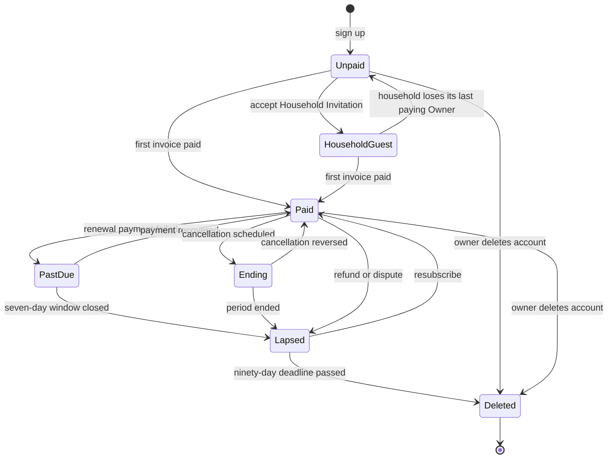

# Subscription ownership and paid-access lifecycle

Decision artifact for [Decide subscription ownership and paid-access
lifecycle](https://github.com/nick-neely/tendnote/issues/567). It fixes who
buys a hosted subscription, what evidence admits an account, what happens when
payment fails, is cancelled, is refunded, or is disputed, what a hosted account
that no longer pays can still do, and how existing private beta accounts and
invited Household Members reach the product. It does not decide the price, the
marketing claims, the hosted privacy obligations, the checkout and portal
implementation, or the cost evidence behind the offer; those remain with their
own tickets, listed at the end.

## Facts this decision rests on

- Tendnote already owns a durable Access Profile per account with a status of
  `pending`, `granted`, or `denied` and a source of `bootstrap`,
  `self_hosted_bootstrap`, `household_invitation`, `manual_grant`, or
  `beta_flag` (`packages/domain/src/access.ts`). Admission is one boolean the
  web and Eve boundaries branch on, and
  [ADR 0067](../adr/0067-private-beta-access-uses-vercel-flags.md) made that
  profile the durable record rather than a derived query.
- Accepting a Household Invitation grants Private Beta Access in the same step,
  on hosted and self-hosted alike
  ([ADR 0232](../adr/0232-self-hosted-admission-is-explicit-and-household-bounded.md)).
  Today an invitation is therefore a full admission path with no payment in it.
- [ADR 0226](../adr/0226-hosted-tendnote-is-us-only-and-has-no-free-tier.md)
  states there is no free hosted tier, self-hosting is the free tier, and
  payment precedes product access rather than following a grace period. The
  admission model has no trial state.
- Stripe's own lifecycle does not answer the access question. An `active`
  subscription does not prove every invoice was paid, `incomplete` mixes
  missing payment with missing authentication, and refund, cancellation, and
  access revocation are three separate operations rather than one. Webhook
  delivery can duplicate and arrive out of order, so business effects must be
  idempotent and recoverable from current objects
  ([Stripe subscription lifecycle constraints](../research/phase-9b-stripe-subscription-lifecycle.md)).
- Only the author holds a hosted account today. Every migration rule below
  moves one real account plus whatever beta grants exist, not a customer base.

## Paid Access is a new admission source

**Paid Access** is the durable fact that a hosted Tendnote account holds
verified payment standing. It is a sibling of Private Beta Access, not a
replacement for it. Hosted admission is:

> a Better Auth session, plus Private Beta Access or Paid Access or Household
> Guest, plus the geo check from ADR 0226.

Tendnote's Access Profile stays the record of admission. Stripe is the record
of money. Webhooks and an idempotent reconciliation job project Stripe facts
onto Paid Access; the request path never calls Stripe to decide whether to
admit anyone. That keeps the admission check a local read, which is the only
shape that survives a Stripe outage, a delayed webhook, or a duplicate event.

Private Beta Access is not retired. It remains the mechanism for the operator
account and for future admission experiments. What it stops being is a way for
anyone to reach the product without paying.

## One account, one subscription

Every hosted person who wants full product access pays for their own
subscription. There is no seat pool, no household plan, and no payer acting for
someone else. An invited Household Member subscribes like anyone else.

This keeps the unit of purchase identical to the unit of data ownership. A
Tendnote account owns its own records, exports them alone
([ADR 0231](../adr/0231-owner-data-export-is-owner-scoped-and-portable.md)),
and leaves a household without taking anything member-owned with it
([ADR 0214](../adr/0214-household-native-records-are-owned-by-the-workspace.md)).
A shared subscription would put billing authority across that boundary and make
one person's cancellation another person's loss of access.

A Household Invitation still reserves membership. On hosted it no longer grants
full admission by itself.

## Evidence that grants Paid Access

The first invoice paid grants Paid Access. Not a completed Checkout redirect,
not an `active` subscription, not a created Customer.

Launch accepts cards only, so that success is synchronous at checkout and the
newcomer is admitted in the same sitting. Delayed methods such as ACH can leave
a subscription `active` while the payment is still processing and fail
afterwards; supporting them means designing for a provisional state, and that
is an explicit later addition rather than something inherited by accident.

## Renewal failure, cancellation, refunds, disputes

**Renewal failure.** Access continues for a seven-day dunning window with an
in-app notice. Stripe's retry schedule does the mechanical work; the seven days
are Tendnote's policy for how long an admitted account stays admitted while a
card is being fixed. When the window ends, Paid Access lapses. This is not a
trial: the account already paid at least once.

**Cancellation.** Self-service through the Stripe customer portal, effective at
period end. No proration and no refund of the remainder. The customer keeps
what they paid for and nothing is clawed back.

**Refunds.** A stated fourteen-day money-back guarantee on a first purchase,
refunded on request. A refund revokes Paid Access immediately and the account
becomes Lapsed. The guarantee is the answer to "no free trial" - someone can
buy, try the real product, and get their money back, without Tendnote operating
a trial state.

**Disputes and chargebacks.** Treated like a refund: Paid Access is revoked
immediately. Winning the dispute later does not re-admit the account
automatically; the author re-admits manually. Automatic re-admission on a
provider signal that can itself be reversed is the wrong default at this scale,
and one account is cheap to handle by hand.

## The Lapsed account

A **Lapsed Account** is signed in but not admitted. It sees the same limited
pending area ADR 0067 defined, and that area offers exactly three things:
resubscribe, export the account's data
([ADR 0231](../adr/0231-owner-data-export-is-owner-scoped-and-portable.md)), and
delete the account. No relationship records, no Today, no Eve.

Data is retained for ninety days from the moment the account enters Lapsed. The
deadline is computed once in the domain and read from both the copy and the
sweep, the same pattern
[ADR 0221](../adr/0221-household-erasure-closes-the-recovery-window-it-opens.md)
established for Household Dissolution: what the product promises and what
actually gets deleted must be one value. Notice goes out before deletion.

Resubscribing returns the account to Paid and clears the deadline.

## Existing private beta accounts

Beta grants end on a stated launch date, announced ahead of it. Each beta
account must subscribe to keep full access; none is grandfathered. The author's
own account is kept by `manual_grant` as the operator exemption, which is what
that source is for.

## Household Invitation on hosted: accept first

Acceptance always yields a membership, on hosted and self-hosted alike. Only
the admission source differs: self-hosted acceptance still admits durably per
ADR 0232, hosted acceptance produces a Household Guest.

Accept-first rather than pay-before-accept, because an invitation must not be
able to expire on someone who is mid-checkout. Making the membership real at
acceptance removes that race entirely.

## Household Guest

A **Household Guest** is an unpaid hosted account that accepted a Household
Invitation. It is consciously a narrow exception to ADR 0226's no-free-tier
clause, and it is the only one.

**What a guest can see.** Read-only access to household-native records,
household-scope records, and shared-scope records addressed to them, across
every domain that has them: People, Memories, Follow-Ups, General Actions,
Assets, Gift Plans where they are a co-planner, Household Context, and
Household Calendar Events.

**What a guest cannot do.** Anything private, and anything that costs. No
private records of any member, no Eve or assistant access, no capture, no
edits, no reminders, no exports, no provider connections, no Suggested Context
Facts. A guest consumes no inference, which is the clause that keeps ADR 0226's
"not a token of inference before willingness to pay" intact.

**How long.** No expiry. The owner rejected a guest clock: a viewing-only
account that disappears on a timer creates a support event with no revenue
attached to it, and an expiry would punish a household for the guest's
indecision rather than for any cost Tendnote is bearing.

**What it depends on.** A paying household. A guest is alive only while at
least one active Household Owner of that household holds Paid Access. If the
last paying Owner lapses, every guest of that household collapses to the
pending area, and returns when an Owner is paid again. The dependency is
checked, not cached, so there is never a guest whose sponsor stopped paying
last month.

A Household Owner may remove a guest through the existing member removal flow,
which already revokes access without touching history
([ADR 0135](../adr/0135-household-member-removal-revokes-access-not-history.md)).

The justification recorded here is deliberate and narrow: someone else is
already paying for this household, and letting that person's partner or
roommate see the shared side of it costs storage and a page render. It does not
cost inference, and it is not a path to the product for anyone without a paying
household behind them. Pay-before-accept was rejected because it makes the
collaboration feature unusable at a scale where nobody has heard of Tendnote
yet.

**A distinct experience, not a reduced one.** The owner confirmed that a guest
does not get the Authenticated App Shell with its controls hidden. Reading
without authority, with no assistant and no capture, is a different product
experience and gets its own interface: its own entry, orientation, read-only
surfaces over the guest read set, a visible reason it is read-only, a path to
subscribe, and an honest state when the household loses its last paying Owner.
Its shape is decided in [The Household Guest
experience](household-guest-experience.md): a read-only library with its own
chrome, paid features absent rather than locked.

## A lapsed member inside a Household

Memberships stay in place. Nothing about payment touches household governance:

- Household-native records remain the workspace's per ADR 0214.
- The lapsed member's private records are retained for ninety days like any
  other Lapsed Account, then deleted.
- No automatic removal from the household, no notification to the Owner, and no
  effect on household capacity.
- The membership UI states "not currently admitted" as a fact, next to the
  member, with no billing detail and no call to action aimed at anyone else.

Payment standing is the account's business. Removing someone from a household
because their card failed would make a billing event into a governance event,
which ADR 0213's separation of governance from everything else exists to
prevent.

## Account state machine

The states below are Tendnote's, product-owned and independent of Stripe's
objects. A Stripe subscription status is an input to reconciliation, never the
thing a page reads.

| State | Meaning | Admitted |
| --- | --- | --- |
| Unpaid | Signed in, never held Paid Access. Pending area with a subscribe call to action. | No |
| Household Guest | Unpaid plus an accepted membership in a paying household. Read-only as described above. | Partially, read-only |
| Paid | Holds Paid Access. | Yes |
| Ending | Paid with a cancellation scheduled for period end. | Yes, with notice |
| Past Due | Renewal failed, inside the seven-day window. | Yes, with notice |
| Lapsed | Paid Access ended by the dunning window closing, a cancellation reaching period end, a refund, or a dispute. Limited area; retention deadline set once on entry. | No |
| Deleted | Retention deadline passed, or the owner deleted the account. Terminal. | No |

Past Due and Ending are decorations on Paid rather than separate admission
answers. That is deliberate: the admission check stays a single decision, and
the notice is presentation. A model where every billing nuance became its own
admission branch is exactly how a request path ends up asking Stripe questions.

Household Guest is entered from Unpaid when an invitation is accepted, and left
either by paying, which moves the account to Paid, or by the household losing
its last paying Owner, which returns it to Unpaid. That second transition is
reversible in both directions.

## Out of scope at launch

Changing the payer or transferring a subscription between accounts. The portal
handles card changes only. A transfer moves billing authority across an
ownership boundary and needs its own decision.

## Self-hosted deployments

Paid Access never exists on a self-hosted deployment. Self-Hosted Admission
Mode is unchanged, no Stripe code path runs there, and a self-hoster is never
asked to configure a payment provider. Paid Access is a hosted concept; ADR
0226 already says self-hosting is the free tier, and this decision does nothing
to narrow that.

## Glossary

`CONTEXT.md` gains Paid Access, Household Guest, and Lapsed Account.

## ADR

[ADR 0245](../adr/0245-paid-access-is-a-hosted-admission-source-owned-by-the-account.md)
records the durable parts: one account one subscription, admission on the first
paid invoice, Tendnote-owned Paid Access projected from Stripe, the ninety-day
lapsed retention, and Household Guest as the sole no-payment hosted state. It
amends ADR 0226's no-free-tier clause to carve out Household Guest.

## Hand-offs

- [Define the cost and reliability evidence needed for a paid offer](https://github.com/nick-neely/tendnote/issues/568):
  Household Guests consume no inference, so they do not enter the per-account
  cost model.
- [Prototype self-service signup through first value](https://github.com/nick-neely/tendnote/issues/569):
  the subscribe call to action in the pending area and the Past Due and
  Ending notices.
- [Prototype the Household Guest experience](https://github.com/nick-neely/tendnote/issues/577):
  the guest's own read-only interface, distinct from the full product.
- [Decide the hosted privacy and customer-lifecycle obligations](https://github.com/nick-neely/tendnote/issues/570):
  the ninety-day lapsed retention, the deletion notice, and the data boundary a
  Household Guest sits behind.
- [Define bounded usage and the author-operated support contract](https://github.com/nick-neely/tendnote/issues/571):
  manual re-admission after a won dispute, and handling refund requests inside
  the guarantee.
- [Define the complete marketing-site and demo experience](https://github.com/nick-neely/tendnote/issues/572):
  stating the fourteen-day guarantee, the one-account pricing unit, and either
  making the guest viewing claim or deliberately omitting it.
- [Decide the paid offer and price from measured evidence](https://github.com/nick-neely/tendnote/issues/573):
  the unit is one account.

## Not decided here

The price and billing interval, the marketing claims, the checkout and portal
implementation, the reconciliation job's schedule, non-card payment methods,
payer transfer, the hosted privacy disclosures, and any support-response
commitment.
